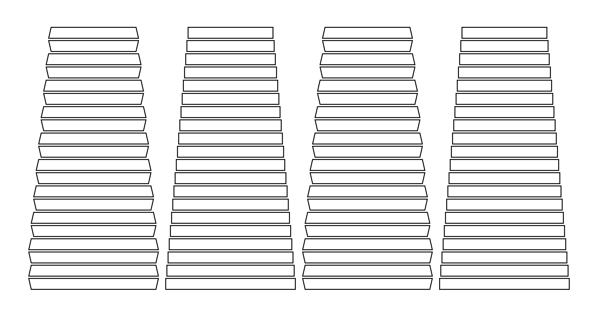

# Large Format Camera Bellows Pattern Generator

[](https://creativecommons.org/licenses/by-nc/4.0/)
[](https://www.python.org/downloads/)

A Python tool to generate cutting patterns for conical camera bellows for large format cameras (4×5, 5×7, 8×10, etc.).



## Features

- ✅ **Accurate geometry**: Trapezoidal top/bottom faces with pair-based progression
- ✅ **Fully parametric**: All dimensions configurable via command line
- ✅ **Multiple formats**: Export to SVG, PNG, JPEG, or PDF
- ✅ **Automatic page splitting**: Split large patterns into A4 or A3 pages
- ✅ **Separate faces**: Generate individual files for each bellows face
- ✅ **Print-ready**: High-resolution output (300 DPI for raster formats)

## Installation

```bash
# Clone the repository
git clone https://github.com/yourusername/bellows-pattern-generator.git
cd bellows-pattern-generator

pip install cairosvg pillow

# Basic usage (SVG only, no dependencies)
python bellows_generator.py

```

## Quick Start

```bash
# Generate a standard 4×5 bellows pattern
python bellows_generator.py

# Custom dimensions for 5×7
python bellows_generator.py --front-w 127 --front-h 178 --rear-w 176 --rear-h 227

# Export as PDF
python bellows_generator.py --format pdf

# Generate separate files for each face
python bellows_generator.py --separate-faces
```

## Usage

### Basic Pattern Generation

```bash
python bellows_generator.py [options]
```

### Dimensions

Standard camera formats:

**4×5 (default)**
```bash
python bellows_generator.py --front-w 96 --front-h 96 --rear-w 145 --rear-h 145
```

**5×7**
```bash
python bellows_generator.py --front-w 127 --front-h 178 --rear-w 176 --rear-h 227
```

**8×10**
```bash
python bellows_generator.py --front-w 203 --front-h 254 --rear-w 254 --rear-h 305
```

### Key Options

| Option | Description | Default |
|--------|-------------|---------|
| `--front-w` | Front width (mm) | 96 |
| `--front-h` | Front height (mm) | 96 |
| `--rear-w` | Rear width (mm) | 145 |
| `--rear-h` | Rear height (mm) | 145 |
| `--max-draw` | Maximum extension (mm) | 300 |
| `--stiffener-height` | Stiffener strip height (mm) | 12 |
| `--gap-height` | Folding gap height (mm) | 2.5 |
| `--stroke-width` | Line thickness (mm) | 1.0 |
| `--stroke-color` | Line color | black |
| `-o`, `--output` | Output filename | bellows_pattern.svg |

### Advanced Features

#### Separate Face Files

Generate 4 individual files (one per face):

```bash
python bellows_generator.py --separate-faces
```

Output:
- `bellows_pattern_face1_top.svg`
- `bellows_pattern_face2_right.svg`
- `bellows_pattern_face3_bottom.svg`
- `bellows_pattern_face4_left.svg`

#### Export Formats

```bash
# PNG (300 DPI)
python bellows_generator.py --format png

# JPEG
python bellows_generator.py --format jpeg

# PDF (vector)
python bellows_generator.py --format pdf
```

#### Automatic Page Splitting

For patterns larger than standard paper sizes:

```bash
# Split into A4 pages (210×297 mm)
python bellows_generator.py --split-a4

# Split into A3 pages (297×420 mm)
python bellows_generator.py --split-a3
```

Pages are numbered: `pattern_page_1_1.svg`, `pattern_page_1_2.svg`, etc.

### Example Combinations

```bash
# 8×10 bellows with long extension, split to A3, exported as PDF
python bellows_generator.py --front-w 203 --rear-w 254 --max-draw 500 \
  --split-a3 --format pdf

# Separate faces in PNG format
python bellows_generator.py --separate-faces --format png

# Red lines for visualization
python bellows_generator.py --stroke-width 0.5 --stroke-color red
```

## Construction Tips

1. **Material**: Use light-tight flexible material (thin leather, coated fabric)
2. **Reinforcements**: The pattern shows stiffener positions for rigidity
3. **Folding**: Mountain/valley folds alternate - mark carefully
4. **Assembly**: Glue faces together with proper alignment
5. **Testing**: Test fit on your camera before final assembly

## Complete Options

Run `python bellows_generator.py --help` for all options:

```
Dimensions:
  --front-w, --front-h     Front dimensions (mm)
  --rear-w, --rear-h       Rear dimensions (mm)

Construction:
  --stiffener-height       Stiffener height (mm)
  --gap-height             Folding gap height (mm)
  --chamfer                Corner chamfer (mm)
  --face-gap               Gap between faces in pattern (mm)
  --max-draw               Maximum extension (mm)

Rendering:
  --margin                 Margin around pattern (mm)
  --stroke-width           Line thickness (mm)
  --stroke-color           Line color

Generation:
  --separate-faces         Generate 4 separate files

Export:
  --format                 svg, png, jpeg, or pdf

Page Splitting:
  --split-a4               Split into A4 pages
  --split-a3               Split into A3 pages
```

## License

This project is licensed under the **Creative Commons Attribution-NonCommercial 4.0 International License** (CC BY-NC 4.0).

You are free to:
- **Share**: Copy and redistribute the material
- **Adapt**: Remix, transform, and build upon the material

Under the following terms:
- **Attribution**: You must give appropriate credit
- **NonCommercial**: You may not use the material for commercial purposes
